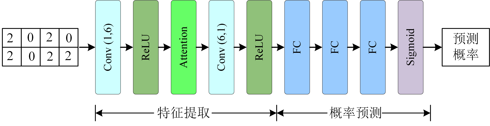
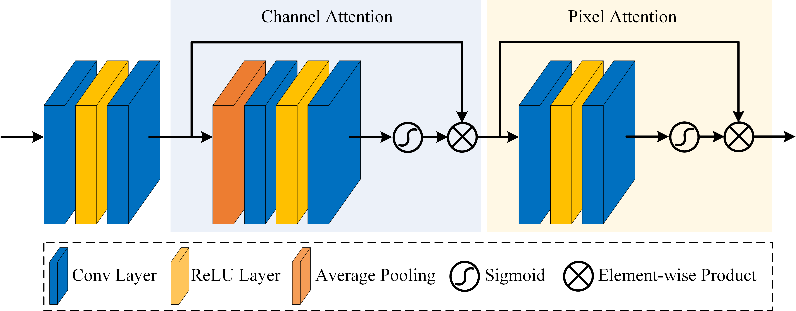

## 数据集说明

该场景的两个时相数据分别是由OHS-3D卫星携载COMSMSS高光谱传感器于2020年6月13日和OHS-3C卫星携载COMSMSS高光谱传感器于2022年6月23日拍摄的辽宁省大连市沿海地带。影像尺寸大小为150×400，空间分辨率为10m，具有32个波段。

### 预处理

根据`data_TR.mat` 的标记信息提取数据集，其中 0 表示该位置不提取数据，1 表示该位置提取数据并且该像素点是不变点，2 表示该位置提取数据并且该像素点是变化点。

根据上述规则，编写数据预处理脚本`preproc.m`,执行该脚本后将提取到的数据保存到`data`文件夹和`label`文件夹下，其数据命名规则为`{行坐标i}_{列坐标j}.mat`,在`data`文件夹内的每个mat文件包括一个2行32列的矩阵，其中第一行表示第 i 行 第 j 列 2020年时相图中 32 个波段的强度数值，第二行数据表示第 i 行 第 j 列 2022 年时相图中 32 个波段的强度数值。与之对应的`label`中保存 0 或 1二值数据，其中 0 表示该点是不变点，1表示该点是变化点。

经过统计，数据集中总样本数为 **6001**

正样本数（变化点）：**878**，占比 **14.63%**

负样本数（不变点）：**5123**，占比 **85.37%**

### 训练数据生成

将整体数据的百分之 90 （约5401）作为训练集，百分之 10 （约600）作为测试集，并保证训练集中正样本占比相同，即各占百分之50，测试集中正样本与负样本占比与数据集整体保持一致。经过计算，训练集中包括 790 个负样本，790 个正样本，测试集中包括512个负样本，88个正样本。

编写脚本`random_train_data.py`用于生成训练集和测试集。

生成的训练数据放在 `train_data` 文件夹下，测试数据放在 `test_data` 文件夹下。

~~将该脚本反复执行 3 次，获得三组不同的训练集与测试集。~~

## 模型介绍

### 问题抽象

根据本次比赛根据其变化检测数据内容，其本质可抽象为基本的二分类问题，其中输入为2×32的数据，输出为分类结果。

### 常见算法

目前常见的分类工具主要包括一下三种：

1. Scikit-learn

   Scikit-learn（sklearn）是通用机器学习库，适合中小型的、实用机器学习项目。

   sklearn 集合很多分类算法，可直接调用。

2. FastText

   fastText是 Facebook AI Research在 2016年开源的文本分类器。其特点就是fast。

   fastText 方法包含三部分：输入层（N-gram 特征）、隐藏层（向量相加求平均）和输出层（层次 Softmax ）。

3. BERT

   BERT 是一个语言表征模型（language representation model），通过超大数据、巨大模型、和极大的计算开销训练而成，在11个自然语言处理的任务中取得了最优结果。

尝试对“分类方法”进行分类，分成机器学习分类、深度学习分类和Attention分类等三个类别，它们的优缺点如下：

|               |           优点           |         缺点         |
| :-----------: | :----------------------: | :------------------: |
| 机器学习分类  |      简单、解释性强      |   特征依赖、难迁移   |
| 深度学习分类  | 表达能力强、注重序列关系 |  长序列缺失、解释难  |
| Attention分类 |     符合人的反馈机制     | 模型大、长文本效果差 |

### 本文模型

#### 环境依赖

##### 软件平台

数据预处理阶段基于 MATLAB R2022a

变化检测模型运行基于 python 

本文模型所依赖的环境见文件 env.yaml

该文件由命令 `conda env export > env.yaml` 导出

核心模块包括：

1. python 3.10
2. pytorch 1.12
3. scipy 1.7.3

##### 硬件平台

本次实验在一台搭载 NVIDIA GTX 2060 6GB GPU 和 Intel Core i7 processor
of 3.60 GHz 的个人电脑上进行。

#### 模型简介

本文设计了一种基于卷积神经网络的分类算法，其模型示意图如下：

网络模型的输入为同一像素位置不同时相下的特征，表现为2行32列的矩阵，其中第一行表示2020年该位置32个波段的强度值，第二行表示2022年该位置32个波段的强度值。

网络的主体部分可以分为特征提取和概率预测两个阶段。

第一个阶段主要包括两个卷积层和一个注意力模块，激活函数采用ReLU。

第二个阶段有三个全连接层和一个Sigmoid 激活层组成。网络最终输出为该像素点是变化点的概率，输出值大于0.5认为该像素点发生变化，小于等于0.5认为该像素点是变化像素点。

其中注意力模块的引入有利于从多个光谱波段中选择敏感波段用于后续的概率预测环节。所谓敏感波段即对于判断是否变化起到积极作用的波段。其模块内部细节如下图所示。

#### 训练细节

训练数据集和测试数据集由随机算法在整体数据集中进行提取，在训练集中包括790个正样本（变化点）和790个负样本（不变点），测试集中包括512个负样本和88个正样本。

在训练集上共进行 100 轮训练，损失函数采用交叉熵损失。

一些超参数的设置如下：

1. 学习率：0.005
2. Batch Size：16

## 实验结果

### 评价标准

本文采用二分类问题中经典的 **准确率**、**精确率**、**召回率**和**F1 score**对模型进行评价。

其计算过程依赖于 混淆矩阵。

|              | 预测正类 | 预测负类 |
| :----------: | :------: | :------: |
| **实际正类** |    TP    |    FN    |
| **实际负类** |    FP    |    TN    |

准确率：
$$
A = \frac{TP+TN}{TP+TN+FP+FN}
$$
精确率（查准率）：
$$
\mathrm{P}=\frac{T P}{T P+F P}
$$
召回率（查全率）：
$$
{R}=\frac{TP}{TP+FN}
$$
F1 score:
$$
{F1}=\frac{2\times P\times R}{P+R}
$$

### 实验结果

本模型在测试集上的测试结果已汇总到 `test_result.csv` 中，该文件用由 `test.py` 生成，重复执行可复现本文实验结果。

其具体指标如下：

1. TP：85
2. FP：63
3. TN：449
4. FN：3
5. 准确率：0.89
6. 精确率：0.5743
7. 召回率：0.9659
8. F1 score：0.7203

从客观实验结果可以得出基本结论，本文模型在海洋遥感变化检测任务中可以取得较好的结果。